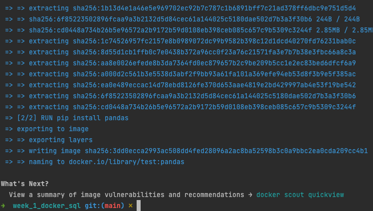
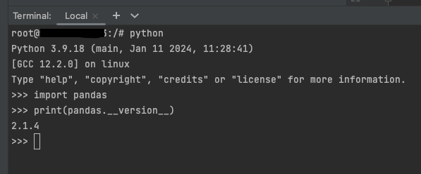

## Week 1: Docker & SQL

[Notes from course](https://docs.google.com/document/d/e/2PACX-1vRJUuGfzgIdbkalPgg2nQ884CnZkCg314T_OBq-_hfcowPxNIA0-z5OtMTDzuzute9VBHMjNYZFTCc1/pub)

### Docker setup and testing

Once you cd into the directory where the `Dockerfile` is present, you can run a test container
with the below command:

```shell
docker run -t test:pandas .
```


Once the test has passed, we can run the container in interactive mode with the following command:

```shell
docker run -it test:pandas
```

We can then verify that pandas has been installed by running `python`
and printing out the pandas version




### Connecting to Postgres DB (assuming port is 5432)
```shell
pgcli -h localhost -p 5432 -u root -d ny_taxi
```

List of useful commands 
```shell
# To list all the databases, run
\l

# To connect to a database
\c [DB_NAME]

# To list all the tables in a db
\dt 

# To list the schema of a table
\d [TABLE_NAME]
```


### Exploring the Yellow trip data

```shell
# To have a quick glance and go through the data
less [FILE_NAME]

# To only see the first n(=100) records
head -n 100 [FILE_NAME]

# To count the number of lines
wc -l [FILE_NAME]
```


### Containerising the pipeline

First, we need to build the image containing the `ingest_data.py` pipeleine as defined in the `Dockerfile`

```shell
docker build -t taxi_ingest:v001 .
```

Once this is ready, we can run the script that runs the container
```shell
./run_ingest_image.sh
```